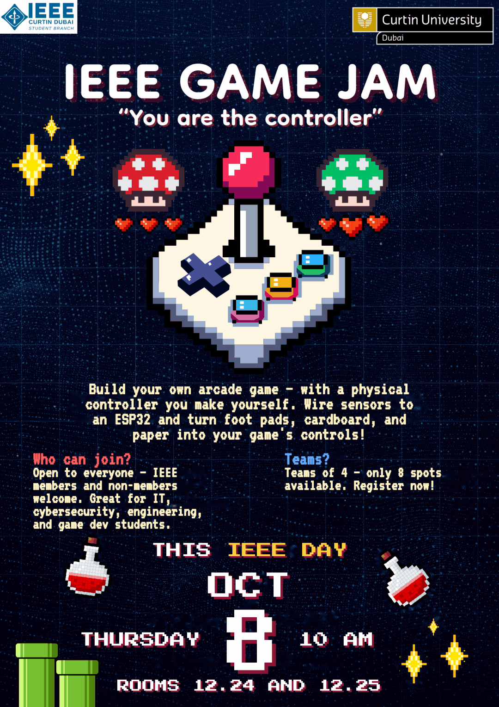

#            👾 IEEE GAME JAM: "You are the Controller" 🎮

Welcome to the official repository for the **IEEE Curtin University Dubai Game Jam**! 

This repository contains all the resources, starter code, and documentation you need to prepare for the event. Whether you are a coding veteran or a first-time game dev, this is your central hub.

## 📅 Event Details
* **Date:** Monday, October 6th
* **Time:** 10:00 AM
* **Location:** Rooms 12.24 and 12.25, Curtin University Dubai
* **Theme:** "You are the Controller"

## 🎯 The Challenge
Build your own arcade game — with a physical controller you make yourself. Wire sensors to an ESP32 and turn foot pads, cardboard, and paper into your game's controls!

## 🛠️ The Hardware Kit
Each team will be provided with the following components to build their physical controller:
* **ESP32 Dev Board** (The brain)
* **MPU-6050 IMU** (Accelerometer + Gyroscope for tilt/motion)
* **Piezo Buzzers** (For sound output AND knock/tap detection)
* **Push Buttons** (For basic inputs)
* **LEDs** (For visual feedback)
* **Wires, Breadboards, and Cardboard** (To build the physical chassis)

## 💻 The Tech Stack
You will use your laptops to run the actual game. The ESP32 will communicate with your laptop via **USB Serial** or **Wi-Fi/Bluetooth**. 
* **Game Engines:** Unity, Godot, Python (Pygame), or Web (HTML5/JS).
* **Communication:** Web Serial API, PySerial, or WebSockets.

## 📂 Repository Structure
Here is what you will find in this repo:
* `/docs` — The Game Jam Inspiration Manual, rules, and judging criteria.
* `/starter-code` — Basic Arduino sketches and Python scripts to get your ESP32 talking to your laptop.
* `/examples` — Example games and controller builds for inspiration.
* `/schematics` — Wiring diagrams for connecting sensors to the ESP32.

## 🚀 Pre-Event Checklist (What to do NOW)
To make the most of your time at the jam, please do the following before you arrive:
1. **Install the Arduino IDE** and the ESP32 Board Manager.
2. **Install Python** (if you plan to use Pygame) or **Unity/Godot** (if you plan to use a game engine).
3. **Read the Inspiration Manual** (in the `/docs` folder) to start brainstorming your game idea.
4. **Form your team!** Teams of 4 max. Only 8 spots available, so register early!

<h2 class="sec">📅 EVENT DAY SCHEDULE</h2>

<table style="width: 100%; border-collapse: collapse; font-family: 'Courier New', monospace; font-size: 18px; color: #fff7d6; background-color: #101f4a; border: 4px solid #2c4390;">
  <thead>
    <tr style="background-color: #ff3d6e; color: #ffffff; font-family: 'Press Start 2P', 'Courier New', monospace; font-size: 12px;">
      <th style="padding: 12px; border: 3px solid #2c4390; text-align: left;">TIME</th>
      <th style="padding: 12px; border: 3px solid #2c4390; text-align: left;">SEGMENT</th>
      <th style="padding: 12px; border: 3px solid #2c4390; text-align: left;">DETAILS &amp; EXECUTION</th>
    </tr>
  </thead>
  <tbody>
    <tr>
      <td style="padding: 12px; border: 3px solid #2c4390; color: #ffd23f; white-space: nowrap;">10:00 – 10:30</td>
      <td style="padding: 12px; border: 3px solid #2c4390; color: #4cd04c; font-weight: bold;">Opening &amp; Info Session</td>
      <td style="padding: 12px; border: 3px solid #2c4390;">Event rules, component walkthrough, and live project/sensor demonstrations. Also a showcase of projects participants can do (the HTML made earlier by Hamdan), which acts as the Q&amp;A before the game-making begins.</td>
    </tr>
    <tr style="background-color: #0d1a3d;">
      <td style="padding: 12px; border: 3px solid #2c4390; color: #ffd23f; white-space: nowrap;">10:30 – 13:30</td>
      <td style="padding: 12px; border: 3px solid #2c4390; color: #4cd04c; font-weight: bold;">Game Jam (3 hours)</td>
      <td style="padding: 12px; border: 3px solid #2c4390;">Hands-on hardware assembly, wiring, ESP programming, and controller building.</td>
    </tr>
    <tr>
      <td style="padding: 12px; border: 3px solid #2c4390; color: #ffd23f; white-space: nowrap;">13:30 – 14:30</td>
      <td style="padding: 12px; border: 3px solid #2c4390; color: #4cd04c; font-weight: bold;">Game Exhibition</td>
      <td style="padding: 12px; border: 3px solid #2c4390;">Live game playtesting, peer interaction, and community voting. Teams also submit the required files to itch.io.</td>
    </tr>
    <tr style="background-color: #0d1a3d;">
      <td style="padding: 12px; border: 3px solid #2c4390; color: #ffd23f; white-space: nowrap;">14:30 – 15:00</td>
      <td style="padding: 12px; border: 3px solid #2c4390; color: #4cd04c; font-weight: bold;">Awards &amp; Closing</td>
      <td style="padding: 12px; border: 3px solid #2c4390;">Awards displayed on screen for winning team photos, followed by a group photo session.</td>
    </tr>
  </tbody>
</table>

## 🤝 Code of Conduct
We are committed to providing a friendly, safe, and welcoming environment for all. Please be respectful to your fellow jammers, mentors, and organizers. 

## 📞 Contact
Gmail: curtin.dubai.ieee@gmail.com
---
**Let the games begin!** 🕹️
