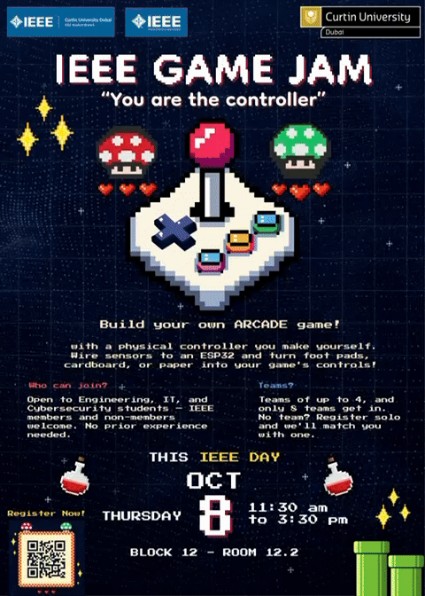

# 👾 IEEE GAME JAM: "You are the Controller" 🎮

Welcome to the official repository for the **IEEE Curtin University Dubai Game Jam**! 

This repository contains all the resources, starter code, and documentation you need to prepare for the event. Whether you are a coding veteran or a first-time game dev, this is your central hub.

## 📅 Event Details
* **Date:** Thursday, October 8th, 2026
* **Time:** 11:30 AM to 3:30 PM (Dubai time)
* **Location:** Curtin University Dubai, Block 12, Room 12.2
* **Theme:** "You are the Controller"
* **Registration:** [https://tally.so/r/2E0GQ9](https://tally.so/r/2E0GQ9)
* **Registration Closes:** October 5th, 2026

## 🎯 The Challenge
Build your own arcade game — with a physical controller you make yourself. Wire sensors to an ESP32 and turn foot pads, cardboard, and paper into your game's controls!

## 🎓 Objectives
1. Give the branch and CuRoSo an activity that everyone can enjoy and socialise in.
2. Build technical skills across the branch's members.
3. Create projects that can be shown at exhibition events.
4. Serve as a test run for bigger future events.

## 🛠️ The Hardware Kit
All sensors and parts are laid out on a table at the front of the room. Teams take what they need, when they need it. Available components include:
* **ESP32 Dev Board** (The brain, sends inputs via Bluetooth)
* **Gyro and Accelerometer Sensors** (Detect tilting, swinging, and shaking)
* **Piezo Discs** (Detect stomps, taps, and knocks)
* **IR & Ultrasonic Sensors** (Detect waving, blocking, and distance)
* **Sound Sensors** (Detect shouts and claps)
* **Push Buttons & Limit Switches** (Detect presses)
* **LEDs** (For visual feedback)
* **Cardboard, Bottles, Tape, Hot Glue, Wires, and Breadboards** (To build the physical chassis)

## 💻 The Tech Stack
You will use your laptops to run the actual game. The ESP32 will communicate with your laptop via **Bluetooth**. 
* **Game Engines:** Unity, Godot, Python (Pygame), or Web (HTML5/JS).
* **Communication:** Bluetooth (acts like a wireless keyboard).
* **Laptops:** Participants must bring their own laptops. Each team needs at least one laptop that can run the Arduino IDE (preferably Windows with Bluetooth).

## 🚀 Before the Event
To make the most of your time at the jam, please do the following before you arrive:
1. **Register:** Sign up via the Tally form by October 5th.
2. **Join the WhatsApp Group:** After registering, join the participant WhatsApp group for updates.
3. **Install Software:** Install the Arduino IDE, ESP32 Board Manager, and your preferred game engine (Unity, Godot, Python, etc.).
4. **Plan Your Game:** Read the Inspiration Manual in the `/docs` folder and start brainstorming.
5. **Form Your Team:** Teams of 4 max. Solo? Register solo and we'll match you with a team.

## 📅 Event Day Schedule

<table style="width: 100%; border-collapse: collapse; font-family: 'Courier New', monospace; font-size: 16px; color: #fff7d6; background-color: #101f4a; border: 4px solid #2c4390;">
  <thead>
    <tr style="background-color: #ff3d6e; color: #ffffff; font-family: 'Courier New', monospace; font-size: 13px;">
      <th style="padding: 12px; border: 3px solid #2c4390; text-align: left;">TIME</th>
      <th style="padding: 12px; border: 3px solid #2c4390; text-align: left;">WHAT'S HAPPENING</th>
      <th style="padding: 12px; border: 3px solid #2c4390; text-align: left;">WHAT YOU'LL DO</th>
    </tr>
  </thead>
  <tbody>
    <tr>
      <td style="padding: 12px; border: 3px solid #2c4390; color: #ffd23f; white-space: nowrap;">11:30 – 12:00</td>
      <td style="padding: 12px; border: 3px solid #2c4390; color: #4cd04c; font-weight: bold;">Opening &amp; Info Session</td>
      <td style="padding: 12px; border: 3px solid #2c4390;">Rules, safety briefing, components walkthrough, live sensor demos, and a showcase of possible projects. Q&amp;A before you start building.</td>
    </tr>
    <tr style="background-color: #0d1a3d;">
      <td style="padding: 12px; border: 3px solid #2c4390; color: #ffd23f; white-space: nowrap;">12:00 – 14:30</td>
      <td style="padding: 12px; border: 3px solid #2c4390; color: #4cd04c; font-weight: bold;">Game Jam (2.5 hours)</td>
      <td style="padding: 12px; border: 3px solid #2c4390;">Collect components, build and wire your controllers, program the ESP32, and connect it to your game. Mentors rotate to help.</td>
    </tr>
    <tr>
      <td style="padding: 12px; border: 3px solid #2c4390; color: #ffd23f; white-space: nowrap;">14:30 – 15:00</td>
      <td style="padding: 12px; border: 3px solid #2c4390; color: #4cd04c; font-weight: bold;">Game Exhibition</td>
      <td style="padding: 12px; border: 3px solid #2c4390;">Play each other's games and vote for the awards in a poll. Submit your final game and Arduino code to itch.io.</td>
    </tr>
    <tr style="background-color: #0d1a3d;">
      <td style="padding: 12px; border: 3px solid #2c4390; color: #ffd23f; white-space: nowrap;">15:00 – 15:30</td>
      <td style="padding: 12px; border: 3px solid #2c4390; color: #4cd04c; font-weight: bold;">Awards &amp; Closing</td>
      <td style="padding: 12px; border: 3px solid #2c4390;">Winners announced on screen with team photos, followed by a group photo.</td>
    </tr>
  </tbody>
</table>

## 🏆 Awards & Voting
Each participant votes for one team per award and cannot vote for their own team. The awards are:

* **Most Innovative:** The group that made us say "Wait... that's actually a good idea."
* **Most Brainrot Game:** The game that permanently damaged everyone's attention span.
* **Best Visuals & Aesthetics:** The game that looked suspiciously more professional than expected.
* **Most Chaotic Gameplay:** The game where nobody knew what was happening, including the developers.
* **Best Bug / Feature Award:** The team that proved sometimes the bug IS the game.
* **Most Addictive Game:** The game that turned "just one more round" into 45 minutes.
* **Most Unexpected Game:** The concept nobody asked for, but everyone enjoyed.
* **Best Overall Vibes:** The group that understood the assignment and brought immaculate vibes.

## 🎉 After the Event
* **Submission:** Teams submit their finished game and their controller's Arduino code to [itch.io](https://itch.io) where anyone can play them.
* **Certificates:** Every participant receives an official certificate of participation from the branch.

## ⚠️ Safety Rules
* **Tools:** Scissors and box cutters must be kept in a safe spot at your table. Never leave them on the floor.
* **Venue:** Nothing may be taped, glued, or attached to the venue (floors, walls, glass, tables, chairs). Builds may only use disposable or recyclable materials. Teams are liable for any damage.

## 🤝 Code of Conduct
We are committed to providing a friendly, safe, and welcoming environment for all. Please be respectful to your fellow jammers, mentors, and organizers.

## 📞 Contact
**Email:** curtin.dubai.ieee@gmail.com

---
**Let the games begin!** 🕹️
